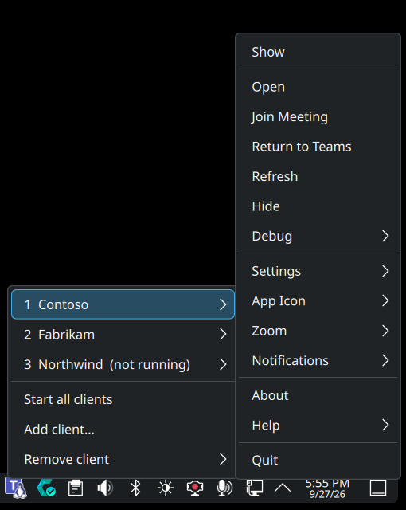
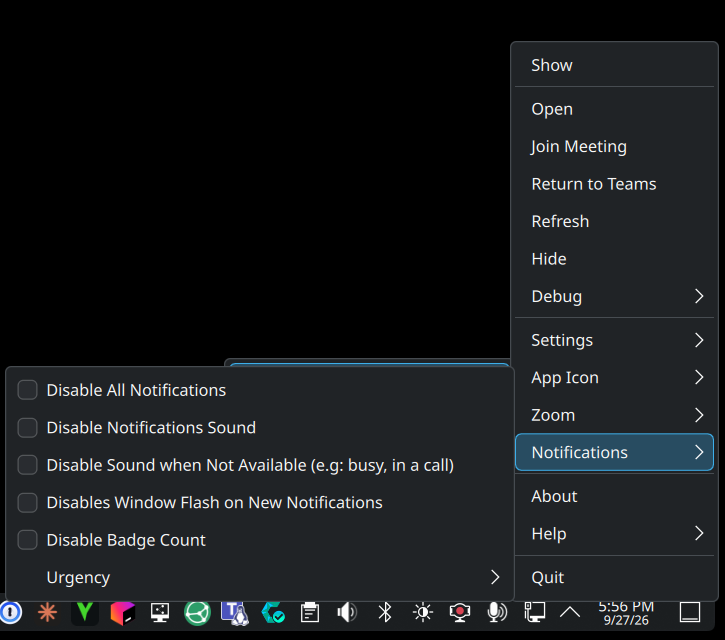

# teams-for-linux-multiclient

Run one fully isolated [Teams for Linux](https://github.com/IsmaelMartinez/teams-for-linux) instance per client/tenant on KDE Plasma 6, managed from **a single tray icon**.

If you work with several organisations you have probably hit this: the built-in account switcher only shows notifications for the account you're looking at, and running separate instances gives you a row of identical Teams icons in the tray. This keeps the separate instances (so every tenant notifies you, all the time) and collapses them behind one icon.

<p>
  
  
</p>

## What you get

- **One process per client**, each with its own profile (`--user-data-dir`), window class and icon badge with the client's initials. Every client stays signed in and delivers notifications whether it's focused or not.
- **One tray icon** with a combined unread badge. The per-instance tray icons are moved to the tray's hidden section automatically.
  - **Hover:** each client with its unread count.
  - **Click (left or right):** a menu with a submenu per client. Each submenu mirrors that client's own Teams for Linux tray menu (Join Meeting, Refresh, Hide, notification settings, Zoom, Quit, …) plus *Show*/*Start*. "Quit (Clear Storage)" is left out on purpose, since one mis-click logs the client out.
  - **Start all clients**, **Add client…** and **Remove client** (keep or delete the login data) right in the menu.
- All clients start minimized at login.
- Optional global shortcuts: `Meta+Shift+T` brings Teams up (a client with unread messages first) or moves to the next client; `Meta+Shift+1…9` jumps to client N.
- `msteams:` / meeting links open in the client you used last.
- Optional: a desktop notification when a scheduled meeting starts (someone joins or starts it), naming the client. Needs `mosquitto`; see below.

## Requirements

- KDE Plasma 6 on Wayland (tested on Plasma 6.7, Qt 6.11; Qt 6.8+ is required for the menu)
- [Teams for Linux](https://github.com/IsmaelMartinez/teams-for-linux) (tested with 2.23) installed as `teams-for-linux` (distro package or AppImage/deb/rpm on `PATH`; Flatpak isn't supported)
- `python-gobject` (PyGObject), `kdialog`
- Optional: ImageMagick (`magick`) for the per-client icon badges
- Optional: `mosquitto` (broker running on localhost) for meeting-start notifications

## Install

```sh
git clone https://github.com/JamesStuder/teams-for-linux-multiclient
cd teams-for-linux-multiclient
./install.sh                 # or ./install.sh --no-shortcuts
```

This installs `~/.local/bin/teams-client` and the *Teams Clients* plasmoid, adds launchers and an autostart entry, enables the tray icon and restarts plasmashell. Then click the Teams icon in the tray, choose **Add client…**, give it a name and sign in to that tenant in the window that opens. Repeat for each client.

Already using separate profiles? Move an existing profile to `~/.config/teams-client-<name>` before adding a client of that name and it will keep its login.

## Command line

```
teams-client add "Contoso"      add a client (opens it for sign-in); number = position
teams-client list               show clients
teams-client focus 2|contoso    start or bring a client to the front
teams-client cycle              same as Meta+Shift+T
teams-client rename 2 "Contoso Ltd"
teams-client remove 2 [--delete-data]
teams-client set-url 2 "https://teams.microsoft.com/v2/?tenantId=<guest tenant id>"
teams-client start-all          start everything minimized
```

Clients are stored in `~/.config/teams-clients/clients.json`; each profile lives in `~/.config/teams-client-<slug>`.

A client that is a guest in another organisation can open straight into that tenant with `set-url`. This helps when the in-app tenant switch fails; the switch can bounce back to the home tenant right after MFA even though the same account signs in to that organisation fine in a browser.

The tray icon also warns when a client is signed out. Each client gets a local-only debugging port (127.0.0.1, stored as `port` in `clients.json`), and `teams-client status` flags any client whose page is a Microsoft or SSO sign-in page. The icon shows a warning mark and the tooltip and menu name the client to sign in again.

### Meeting-start notifications

Teams for Linux doesn't show a desktop notification when a scheduled meeting starts. It can spot Teams' own "meeting started" toast (an experimental feature), but it only reports that over MQTT. If `mosquitto` is installed and running on 127.0.0.1:1883 when `teams-client setup` runs, each profile's `config.json` gets an `mqtt` block that points at the local broker (topic `teams-clients/<slug>/meeting-started`), and the `teams-meeting-watch` user service turns each report into a notification with an *Open Teams* button. The new config is read when a client next starts, so restart the clients once (tray menu → Quit all clients, then Start all clients).

## How it works

- Each client runs as `teams-for-linux --class=teams-<slug> --user-data-dir=~/.config/teams-client-<slug> …`, the separate-instances approach from the upstream [multiple instances docs](https://github.com/IsmaelMartinez/teams-for-linux/blob/main/docs-site/docs/multiple-instances.md).
- Electron registers each tray icon as a StatusNotifierItem with Id `teams-<slug>_status_icon_1`. `teams-client` lists them in the system tray's `hiddenItems`, reads each one's unread count from its tooltip and its menu over `com.canonical.dbusmenu`, and forwards clicks back through the same interface.
- The `teams-client-status` user service (`teams-client status-daemon`) refreshes the status every 3 s into `$XDG_RUNTIME_DIR/teams-client.status.json`, and the plasmoid just reads that file, so polling doesn't start Python every few seconds. If the file is missing or stale the plasmoid runs `teams-client status` itself.
- Windows are found and raised with one-shot KWin scripts. A window that was hidden to the tray is brought back by triggering that client's own *Open* menu item.
- Shortcuts are registered with kglobalaccel as launch shortcuts for small `.desktop` files, so they show up (and can be changed) in System Settings → Shortcuts.

## Uninstall

```sh
./uninstall.sh
```

Client profiles (logins) and the client list are kept; delete `~/.config/teams-client-*` and `~/.config/teams-clients` to remove them too.

## Notes

- Unofficial and not affiliated with Microsoft or the Teams for Linux project.
- Upstream is working on an in-app multi-account switcher ([ADR-020](https://github.com/IsmaelMartinez/teams-for-linux/blob/main/docs-site/docs/development/adr/020-multi-account-profile-switcher.md)) with background notifications planned for a later phase. Until then, this is a way to get notifications from every tenant with a clean tray.

## License

MIT
